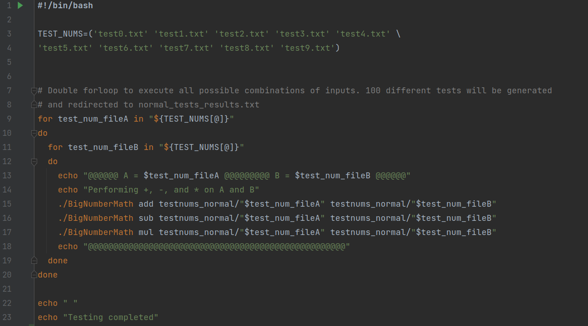
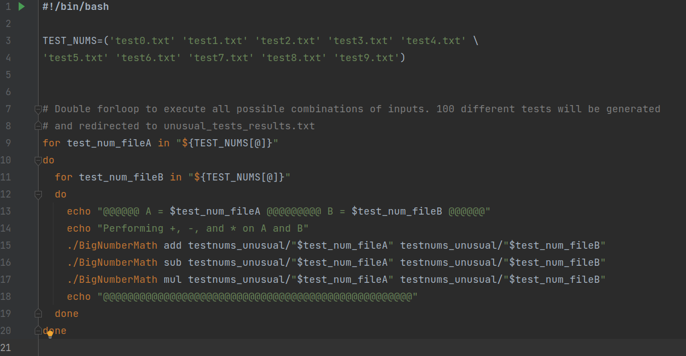
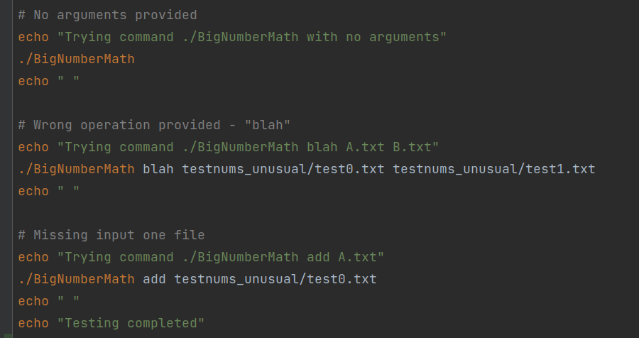

### Testing suites
**I've generated two testing suites to automate the testing of many combinations of test inputs.
The first testing suite is provided by bash script "testsuite_normal.sh"**

**This script performs a double loop over 10 different inputs, found in the "testnums_normal" dir.
I focused on using a wide range of knowingly valid inputs to assess
the accuracy of the outputs. 100 different tests are generated from different combinations of these inputs. Addition, Subtraction, and 
Multiplication are all performed with each test configuration (resulting in 300 operations in total). 
All outputs are found in "normal_tests_results.txt". These tests can be performed again by running the script
"./testsuite_normal.sh".**

**The next script (testsuite_unusual.sh) performs 303 tests over unusual cases to properly access
the program's ability to identify faulty input. Shown below.**

**The first part is identical to the normal testing script. However, the difference is found with the inputs.
File inputs that include illegal characters, multiple decimal places, weird formatting of numbers, are all tested
with this test suite. Results to this test suite are found in "unusual_tests_results.txt", and these tests can be seen
in action by running "./testsuite_unusual.sh".**

**In addition to testing strange input values, the unusual testing suite also tests the programs' response
to not supported operations and a lack of commandline arguments to properly run the code. Bash code shown below.**

**As shown above, the program is tested with no arguments provided, missing input files, and unknown operations.
The program responds with telling the user the proper formatting for running the code. As shown at the end of 
"unusual_tests_results.txt".**

**If one wants to alter the numbers provided in the testing input files (test0.txt, text1.txt, etc) and rerun the test.
A single command can be used to delete the old results and write the new results by running "./full_testing.sh".**